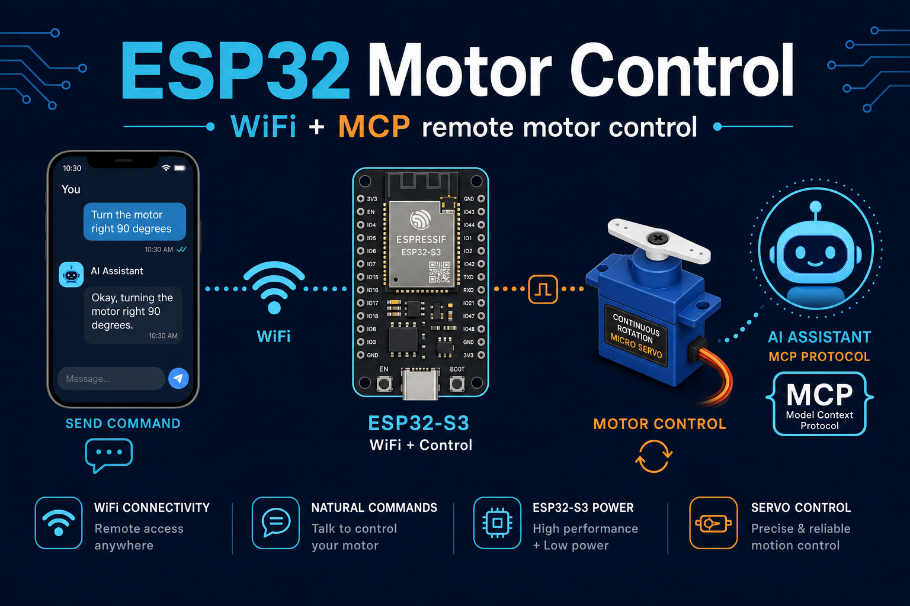

# ESP32 Motor Control — WiFi + MCP 원격 모터 제어



ESP32 자체에 HTTP 서버를 띄우고, 폰/PC/AI 어디서든 WiFi 로 모터를 제어한다.
AI(Claude 등)는 표준 MCP 프로토콜로, 사람은 브라우저/curl 로 — 두 경로 모두 ESP32 하나로 수렴.

```
Claude (MCP tools) ─→ esp32-motor-mcp (Rust stdio MCP) ─→ HTTP ─→ ESP32 웹서버 ─→ 연속회전 서보
폰 브라우저 / curl ──────────────────────────────────────→ ↗
```

- 펌웨어: Arduino (ESP32-S3 / 일반 ESP32), 외부 라이브러리 의존 0
- MCP 서버: Rust, JSON-RPC stdio 직접 구현 (의존성 serde_json 뿐)
- 범용 시퀀스 언어: "왼쪽 2바퀴 돌고 1초 쉬고 오른쪽 1바퀴" = `L2,W1,R1`

## 1. 주문 부품 (영상 실물 기준 명칭)

| 영상 속 부품 | 주문 검색어 (쿠팡/디바이스마트/엘레파츠) | 참고 |
|---|---|---|
| ESP32 개발보드 (검정, USB-C 2개) | **ESP32-S3-DevKitC-1** 또는 "ESP32-S3 개발보드 N16R8" | USB-C 1개짜리 일반 "ESP32 DevKit V1"(WROOM-32)도 동일 동작 |
| 파란색 소형 모터 (360도 회전) | **FS90R 연속회전 서보** 또는 "SG90 360도 연속회전 서보" | 일반 SG90(180도)은 바퀴 회전 불가 — 반드시 "360도/연속회전(continuous rotation)" 표기 확인 |
| 연결선 | 점퍼케이블 암-수 (F-M) 3개 | 서보 케이블 3핀 |

일반 SG90 = 각도 제어용(0~180도). 영상처럼 "2바퀴 돌려"가 되려면 연속회전형이어야 함.
정밀한 바퀴 수가 중요해지면 스텝모터(28BYJ-48 + ULN2003 드라이버)로 업그레이드 권장 — 영상 채팅에도 같은 언급 있음.

## 2. 배선

| 서보 선 | ESP32 핀 |
|---|---|
| 주황/노랑 (신호) | GPIO 4 |
| 빨강 (VCC) | 5V (VIN) |
| 갈색/검정 (GND) | GND |

USB 5V 전원으로 서보 1개는 충분. 여러 개 달면 외부 5V 전원 분리.

## 3. 펌웨어 업로드 (Arduino IDE)

1. Arduino IDE 설치 → 환경설정 → 추가 보드 매니저 URL:
   `https://espressif.github.io/arduino-esp32/package_esp32_index.json`
2. 보드 매니저에서 "esp32 by Espressif" 설치
3. `esp32_motor_control/config.h` 에서 `WIFI_SSID`/`WIFI_PASS` 수정
4. 보드 선택: **ESP32S3 Dev Module** (일반 ESP32면 "ESP32 Dev Module")
5. 업로드 → 시리얼 모니터(115200)에 IP 출력됨. 이후 USB 분리 가능(전원만 연결)

WiFi 연결 실패 시 ESP32 가 자체 AP(`ESP32-MOTOR` / `motor1234`)를 띄움 → 폰으로 접속 후 `http://192.168.4.1`

## 4. 사용법

### 폰/PC 브라우저
`http://<ESP32_IP>/` — 버튼 UI (왼쪽/오른쪽 N바퀴, 연속회전, 정지, 시퀀스)

### API (curl / Claude / 자동화)
```bash
# 영상 속 명령: "왼쪽으로 2바퀴 돌고 1초 쉬고 우측으로 1바퀴"
curl "http://<IP>/api/seq?seq=L2,W1,R1"

curl "http://<IP>/api/turn?dir=left&turns=2"      # 왼쪽 2바퀴
curl "http://<IP>/api/turn?dir=right&turns=1&speed=50"  # 50% 속도
curl "http://<IP>/api/seq?seq=S-100"              # 왼쪽 무한 회전
curl "http://<IP>/api/stop"                       # 정지
curl "http://<IP>/api/status"                     # 상태 JSON
```

시퀀스 문법 (범용 — 조합으로 어떤 응용 명령이든 표현):

| 토큰 | 의미 |
|---|---|
| `L<바퀴>` / `R<바퀴>` | 왼쪽/오른쪽 n바퀴. 소수 가능 (`L0.25` = 왼쪽 90도) |
| `W<초>` | 대기 |
| `S<±속도%>` | 연속회전 (음수=왼쪽), `/api/stop` 까지 |
| `S<±속도%>X<초>` | 시간지정 회전 (`S-50X3` = 왼쪽 50% 로 3초) |
| `@<속도%>` | 해당 스텝 속도 (`L2@50` = 왼쪽 2바퀴를 절반 속도로) |
| `&repeat=N` | 시퀀스 전체 N회 반복 |

응용 명령 변환 예:

| 자연어 명령 | API 호출 |
|---|---|
| 왼쪽 2바퀴 돌고 1초 쉬고 오른쪽 1바퀴 | `seq=L2,W1,R1` |
| 좌우로 반바퀴씩 3번 왔다갔다 | `seq=L0.5,R0.5&repeat=3` |
| 오른쪽으로 천천히 90도 | `seq=R0.25@20` |
| 왼쪽으로 5초간 돌다가 멈추고 오른쪽 3바퀴 | `seq=S-100X5,W0.5,R3` |
| 시계방향으로 계속 돌려 | `seq=S100` |

### 보정 (바퀴 수 정확도)
연속회전 서보는 시간 기반 근사라 개체별 실측 보정 필요:
```bash
curl "http://<IP>/api/cal_run?dir=left"    # 정확히 10초 회전 — 바퀴 수를 눈으로 센다
curl "http://<IP>/api/cal?spr_left=0.625"  # 10초에 16바퀴였으면 10/16=0.625
# 정지 상태에서 미세하게 돌면: curl "http://<IP>/api/cal?stop_us=1480" (1500 근처로 조절)
```
보정값은 NVS 에 저장되어 재부팅 후에도 유지.

## 5. MCP 원격 제어 (표준 경로 — 영상의 AI 채팅 부분)

`mcp-server/` = Rust stdio MCP 서버. ESP32 HTTP API 를 표준 MCP tools 로 노출.
Claude Code 에 user 스코프로 등록 완료 (`claude mcp list` → esp32-motor Connected).

| MCP tool | 기능 |
|---|---|
| `motor_status` | 상태 조회 (회전중/큐/보정값/IP/신호세기) |
| `motor_turn` | 방향+바퀴수+속도 회전 |
| `motor_seq` | 범용 시퀀스 실행 (L/R/W/S 문법 + repeat) |
| `motor_stop` | 즉시 정지 |
| `motor_calibrate` | 보정값 설정 (NVS 저장) |
| `motor_cal_run` | 10초 회전 보정 도우미 |

사용: Claude 세션에서 "모터 왼쪽 2바퀴 돌고 1초 쉬고 오른쪽 1바퀴" → `motor_seq(seq="L2,W1,R1")` 자동 호출.

ESP32 주소 설정 (둘 중 하나):
- 기본: `~/.claude.json` 의 esp32-motor env `ESP32_MOTOR_URL` (현재 AP 폴백 주소 http://192.168.4.1 — 보드가 공유기에 붙으면 실제 IP 로 변경)
- 호출별: 각 tool 의 `host` 인자로 재정의

재빌드: `cd mcp-server && cargo build --release`

MCP 를 안 쓰는 클라이언트(폰 브라우저, curl, 타 자동화)는 4번 API 를 그대로 사용 — 두 경로 모두 ESP32 자체 서버 하나로 수렴.
